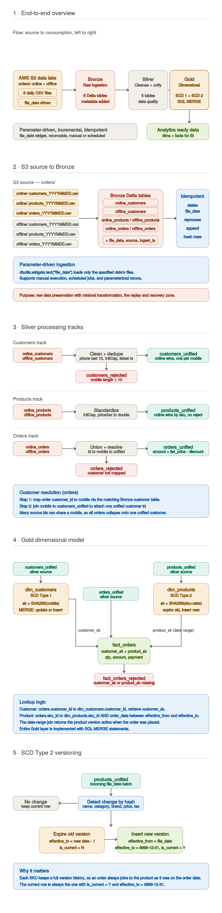
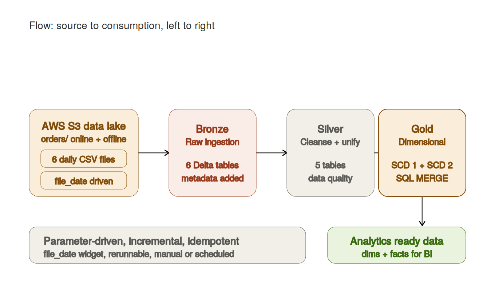
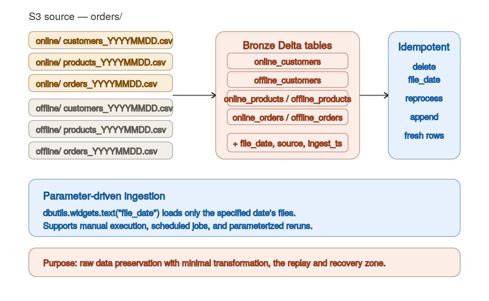
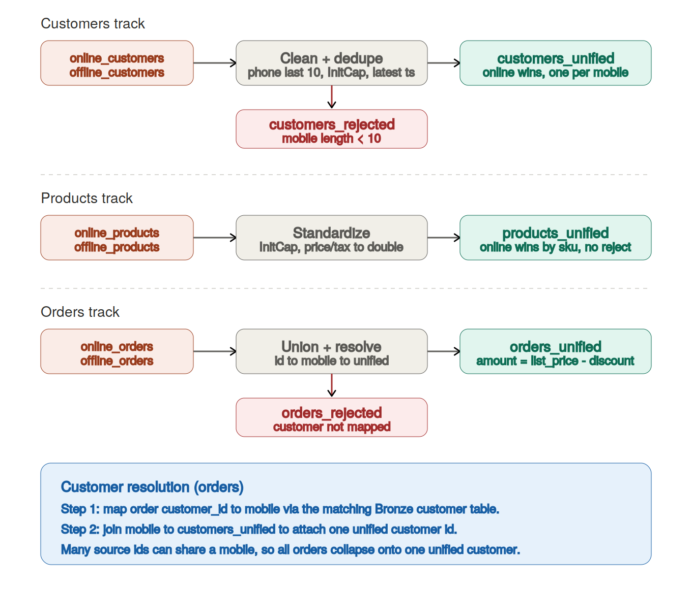
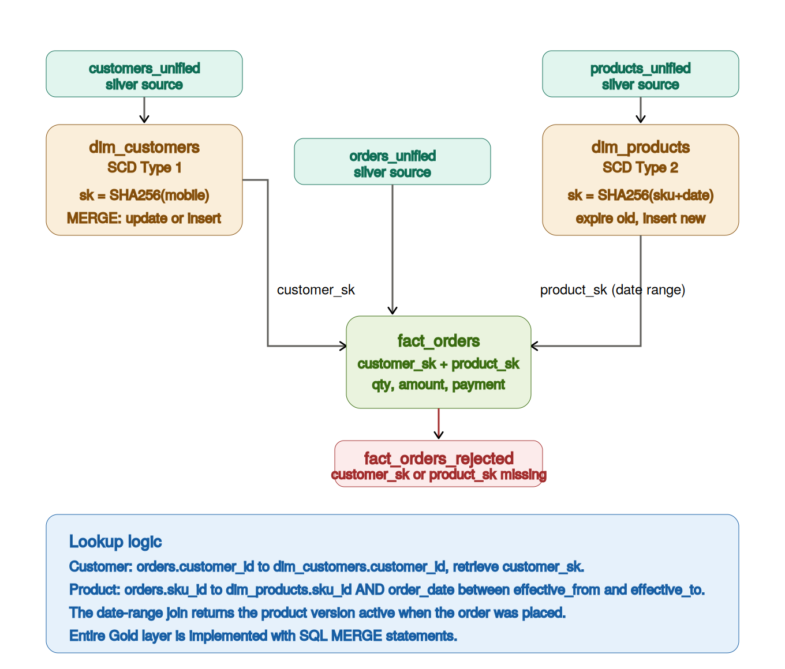
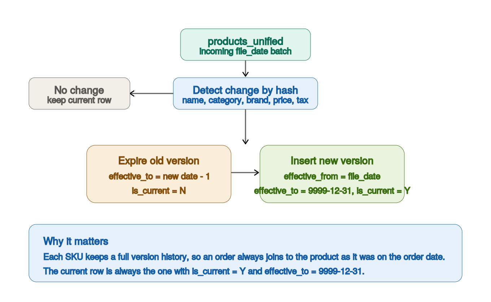

# 🛍️ Retail Medallion Data Pipeline

### Databricks · PySpark · Delta Lake · AWS S3 · SQL MERGE

<p>
  
  
  
  
  
  
</p>

---

## 📖 Project Overview

An end-to-end **retail data engineering pipeline** built on **Databricks** with **AWS S3** as the data source and **Delta Lake** as the storage layer, following the **Medallion Architecture** (Bronze → Silver → Gold).

The pipeline ingests daily online and offline customer, product, and order files, performs cleansing and business transformations with data-quality checks, and builds an analytics-ready dimensional model using **SQL MERGE** with **SCD Type 1** and **SCD Type 2** dimensions.

It is **parameter-driven** (a `file_date` widget), **incremental**, and **idempotent** — any batch can be safely re-run without creating duplicates.

---

## 🏗️ Architecture

```
AWS S3  ──▶  Bronze (Raw)  ──▶  Silver (Transform + DQ)  ──▶  Gold (Dimensional)  ──▶  Analytics
```

| Layer | Color | Purpose |
| :---- | :---- | :------ |
| 🟠 **AWS S3** | Orange | Source data lake (daily batch CSVs) |
| 🟤 **Bronze** | Copper | Raw ingestion with metadata, minimal transformation |
| ⚪ **Silver** | Grey | Cleansing, standardization, deduplication, unified datasets |
| 🟡 **Gold** | Gold | Dimensional modeling via SQL MERGE (SCD 1 & 2) |

### Full Architecture Diagram



<details>
<summary>📂 <b>View individual diagrams</b></summary>

#### 1 · End-to-end overview


#### 2 · S3 source to Bronze


#### 3 · Silver processing tracks


#### 4 · Gold dimensional model


#### 5 · SCD Type 2 versioning


</details>

---

## 🧰 Technology Stack

| Category | Tools |
| :------- | :---- |
| **Platform** | Databricks |
| **Processing** | Apache Spark (PySpark) |
| **Storage** | Delta Lake |
| **Source** | AWS S3 |
| **Languages** | Python, SQL |
| **Modeling** | Dimensional modeling, SCD Type 1 & 2, SQL MERGE |
| **Version Control** | Git & GitHub |

---

## 📥 Source Data Structure

Data lands in S3 under an `orders/` prefix, split into `online/` and `offline/` channels. Files are **daily batches** with a date suffix and are loaded **incrementally** by `file_date`.

```text
orders/
├── online/
│   ├── customers_YYYYMMDD.csv
│   ├── products_YYYYMMDD.csv
│   └── orders_YYYYMMDD.csv
└── offline/
    ├── customers_YYYYMMDD.csv
    ├── products_YYYYMMDD.csv
    └── orders_YYYYMMDD.csv
```

| Domain | Online | Offline |
| :----- | :----- | :------ |
| 👥 **Customers** | `online/customers_*.csv` | `offline/customers_*.csv` |
| 📦 **Products** | `online/products_*.csv` | `offline/products_*.csv` |
| 🧾 **Orders** | `online/orders_*.csv` | `offline/orders_*.csv` |

---

## 🧱 Medallion Architecture

| Layer | Input | Output | Key Operations |
| :---- | :---- | :----- | :------------- |
| **Bronze** | Raw S3 CSVs | 6 raw Delta tables | Incremental ingestion, metadata capture |
| **Silver** | Bronze tables | 5 curated tables | Cleansing, dedup, unification, DQ checks |
| **Gold** | Silver tables | 4 modeled tables | SQL MERGE, SCD 1 & 2, surrogate keys |

---

## 🟤 Bronze Layer Design

**Platform:** Databricks + Delta Tables
**Purpose:** Raw ingestion with minimal transformation — the replay and recovery zone.

### Tables
```
online_customers     offline_customers
online_products      offline_products
online_orders        offline_orders
```

### Metadata Columns Added
| Column | Description |
| :----- | :---------- |
| `file_date` | Business date of the source file |
| `source` | Origin channel (`online` / `offline`) |
| `ingest_ts` | Ingestion timestamp |

### Incremental & Idempotent Ingestion
The Bronze notebook loads **only** the file date passed through a Databricks widget:

```python
dbutils.widgets.text("file_date", "")
file_date = dbutils.widgets.get("file_date")
```

**Rerun strategy (idempotent):**
1. Delete current `file_date` partition data
2. Reprocess the batch
3. Append fresh records

> ⚙️ Supports **manual**, **scheduled**, and **parameter-driven** execution.

---

## ⚪ Silver Layer Design

**Platform:** Databricks + Delta Tables
**Purpose:** Standardization, data-quality checks, deduplication, and unified datasets.

**Output tables:** `customers_unified` · `customers_rejected` · `products_unified` · `orders_unified` · `orders_rejected`

### 👥 Customers Processing

**Phone cleansing:** trim → remove special characters → keep last 10 digits
**Standardization:** `customer_name`, `city`, `state` → InitCap · `email` → lowercase

**Deduplication**
- Within each source: partition by mobile number, keep the latest `ingest_ts`
- Cross-source rule: **always prefer Online**; an Offline customer is retained only if they do not exist in Online
- Result: **one customer per mobile number**

| Output | Reject Table | Reject Reason |
| :----- | :----------- | :------------ |
| ✅ `customers_unified` | ❌ `customers_rejected` | Mobile number length < 10 |

### 📦 Products Processing

**Standardization:** `product_name`, `category`, `brand` → InitCap · `currency` → uppercase · `price`, `tax_rate` → double

**Cross-source rule:** always prefer Online; an Offline product is retained only if its SKU does not exist in Online.

| Output | Reject Table |
| :----- | :----------- |
| ✅ `products_unified` | None |

### 🧾 Orders Processing

**No deduplication** — Online and Offline orders are combined with a `UNION`.

**Transformations:** `quantity` → int · `list_price`, `discount` → double · `payment_mode` → uppercase · online orders `store_num = 'NA'`
**Amount:** `amount = list_price - discount`

**Customer resolution (two steps):**
1. Map order `customer_id` → mobile number using the matching Bronze customer table
2. Join mobile number → `customers_unified` to attach the final unified customer id

> 🔁 Multiple source customer IDs can map to the same mobile number, so all orders collapse onto **one unified customer**.

| Output | Reject Table | Reject Reason |
| :----- | :----------- | :------------ |
| ✅ `orders_unified` | ❌ `orders_rejected` | Customer cannot be mapped to `customers_unified` |

---

## 🟡 Gold Layer Design

**Platform:** Databricks Delta Lake
**Implementation:** The **entire Gold layer is built with SQL `MERGE` statements**.

**Tables:** `dim_customers` · `dim_products` · `fact_orders` · `fact_orders_rejected`

---

### 👤 SCD Type 1 Implementation — `dim_customers`

| Property | Value |
| :------- | :---- |
| **Type** | SCD Type 1 (overwrite) |
| **Source** | `customers_unified` |
| **Business Key** | `mobile_clean` |
| **Surrogate Key** | `SHA256(mobile_clean)` |

**Change detection hash:** `customer_name`, `email`, `city`, `state`, `zipcode`, `signup_date`, `store_id`

```sql
MERGE INTO dim_customers t
USING staged_customers s
  ON t.customer_id = s.customer_id
WHEN MATCHED     THEN UPDATE SET ...   -- refresh latest attributes
WHEN NOT MATCHED THEN INSERT ...       -- add new customer
```

**Audit columns**
- `ingest_ts` → first insertion timestamp
- `last_update_ts` → latest modification timestamp
- If both are equal → the customer has never been updated

---

### 🏷️ SCD Type 2 Implementation — `dim_products`

| Property | Value |
| :------- | :---- |
| **Type** | SCD Type 2 (full history) |
| **Source** | `products_unified` |
| **Business Key** | `sku_id` |
| **Surrogate Key** | `SHA256(sku_id + file_date)` |

**Change detection columns:** `product_name`, `category`, `brand`, `price`, `tax_rate`, `currency`, `is_active`

**Versioning columns:** `effective_from` (DATE), `effective_to` (DATE), `is_current`

**When an attribute changes:**

| Step | Action |
| :--- | :----- |
| 1 | Expire current row → `effective_to = new effective_from - 1 day`, `is_current = 'N'` |
| 2 | Insert new version → `effective_from = current file_date`, `effective_to = 9999-12-31`, `is_current = 'Y'` |

> 🕒 The current record always has `is_current = 'Y'` and `effective_to = 9999-12-31`.

---

### 📊 Fact Table Design — `fact_orders`

**Source:** `orders_unified`

**Lookups**
| Lookup | Join | Returns |
| :----- | :--- | :------ |
| Customer | `orders.customer_id = dim_customers.customer_id` | `customer_sk` |
| Product | `orders.sku_id = dim_products.sku_id` **AND** `order_date BETWEEN effective_from AND effective_to` | `product_sk` |

> 🎯 The product date-range join retrieves the **correct historical product version** that was active when the order was placed.

**Columns:** `order_id`, `order_ts`, `customer_sk`, `product_sk`, `quantity`, `list_price`, `discount`, `amount`, `payment_mode`, `store_num`, `source`, `file_date`, `ingest_ts`

| Output | Reject Table | Reject Reason |
| :----- | :----------- | :------------ |
| ✅ `fact_orders` | ❌ `fact_orders_rejected` | `customer_sk` missing **OR** `product_sk` missing |

---

## 🔁 Incremental Processing Strategy

- **Parameter-driven:** every layer is executed for a single `file_date` passed via a Databricks widget
- **Idempotent Bronze:** delete → reprocess → append guarantees no duplicates on rerun
- **MERGE-based Gold:** upserts keep dimensions and facts consistent across reruns
- **Metadata tracking:** `file_date`, `source`, `ingest_ts` carried through every layer

---

## 🛡️ Data Quality & Reject Handling

| Stage | Reject Table | Condition |
| :---- | :----------- | :-------- |
| Silver — Customers | `customers_rejected` | Mobile number length < 10 |
| Silver — Orders | `orders_rejected` | Customer not resolvable to `customers_unified` |
| Gold — Fact | `fact_orders_rejected` | Missing `customer_sk` or `product_sk` |

> 🚫 Reject tables are **terminal** — rejected records are isolated for review and never flow downstream.

---

## ▶️ Pipeline Execution Steps

```
Pass file_date parameter
        ↓
Bronze ingestion
        ↓
Silver transformation
        ↓
Gold dimension loading (dim_customers, dim_products)
        ↓
Gold fact loading (fact_orders)
        ↓
Analytics ready data
```

**Run example**
```python
dbutils.widgets.text("file_date", "20240115")
# Execute notebooks in order: bronze → silver → gold_dimensions → gold_facts
```

> Supports **manual execution**, **Databricks Job scheduling**, and **incremental reruns**.

---

## 📁 Project Folder Structure

```text
retail-medallion-data-pipeline
│
├── bronze
│   └── bronze_ingestion.ipynb
│
├── silver
│   └── silver_transformation.ipynb
│
├── gold
│   └── gold_dimensional_model.ipynb
│
├── architecture
│   ├── full_architecture.png
│   ├── overview.png
│   ├── source_bronze.png
│   ├── silver.png
│   ├── gold.png
│   └── scd_type2.png
│
└── README.md
```

> 📓 Each layer lives in its own folder with a single Databricks notebook: `bronze/` handles raw ingestion, `silver/` handles cleansing and unification, and `gold/` handles the dimensional model and SCD logic.

---

## ✨ Key Features

`Medallion Architecture` · `Incremental Processing` · `Parameterized file_date Execution` · `Delta Lake Tables` · `Databricks Widgets` · `SQL MERGE Operations` · `SCD Type 1` · `SCD Type 2` · `SHA256 Surrogate Keys` · `Data Quality Checks` · `Reject Handling` · `Idempotent Pipeline Design` · `Batch Processing` · `Metadata Tracking` · `Rerunnable Pipeline`

---

## 🚀 Future Enhancements

- [ ] Parallel execution of independent workloads
- [ ] Workflow orchestration using Databricks Jobs
- [ ] CI/CD integration using GitHub Actions
- [ ] Automated testing framework
- [ ] Data quality monitoring dashboards
- [ ] Performance optimization and partitioning
- [ ] Data lineage and observability

---

## 👤 Author

**Gautham Shetty**
Master of Science in Management Information Systems · Texas A&M University

[](https://www.linkedin.com/in/gauthamvshetty)
[](https://github.com/GauthamShetty5)
